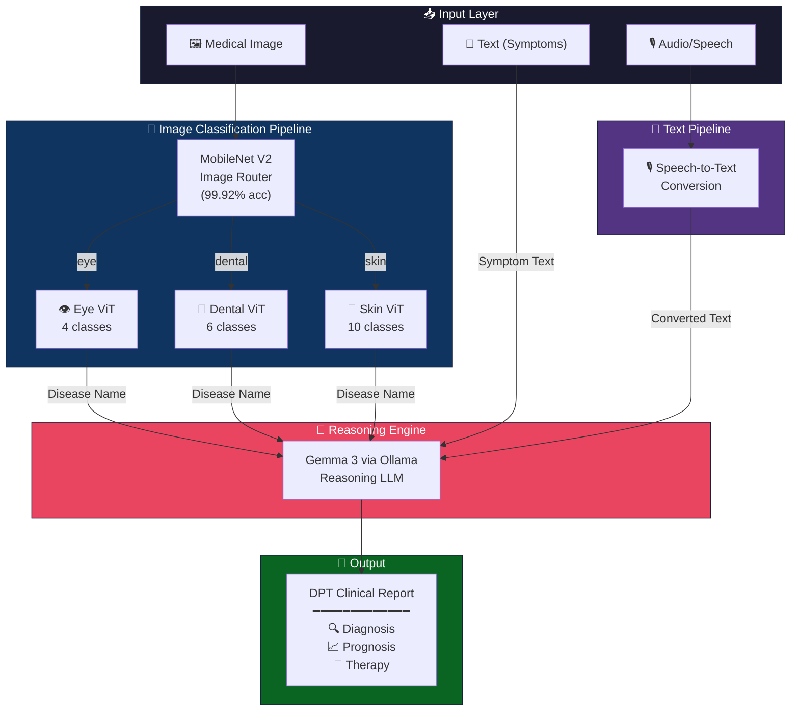

# DPT Clinical Decision Support Engine

## Diagnostic, Prognostic & Therapeutic (DPT)

> **Note:** Trained model weights (.pth files) are not included in this repository due to file size constraints. You need to train them yourself using the provided training scripts (`vit_eye_disease.py`, `vit_dental_disease.py`, `vit_skin_disease.py`, `mobilenet_router.py`) on the Kaggle datasets listed below, and place the resulting `.pth` files in a `Models/` directory.

---

## 1. Project Overview

The **DPT Clinical Decision Support Engine** is an AI-powered multimodal medical assistance system that accepts patient data through **three input modalities** — images, text, and audio — and generates a comprehensive clinical report covering **Diagnosis**, **Prognosis**, and **Therapy** recommendations.

The system combines **computer vision** (deep learning classifiers), **speech recognition**, and **large language model reasoning** into a unified pipeline that mimics the diagnostic workflow of a medical professional.

> [!IMPORTANT]
> This is a **decision support** tool — it assists healthcare professionals with preliminary analysis, not a replacement for clinical judgment.

---

## 2. System Architecture



---

## 3. Input Modalities

### 3.1 🖼️ Image Input
The user uploads a medical image — this could be a **retinal scan**, **dental/tooth photograph**, or **skin lesion image**. The system automatically identifies which type of medical image it is and classifies the specific disease.

### 3.2 📝 Text Input
The user types their **symptoms** in natural language (e.g., *"I have red patches on my skin that are itchy and scaling"*). This text is sent directly to the reasoning LLM for analysis.

### 3.3 🎙️ Audio/Speech Input
The user speaks their symptoms aloud. The audio is converted to text via **Speech-to-Text**, and the resulting text is processed identically to the text input pathway.

---

## 4. Pipeline Components

### 4.1 MobileNet V2 — Image Router (Gateway Model)

| Property | Detail |
|---|---|
| **Purpose** | Classify the input image into one of 3 medical domains |
| **Architecture** | MobileNet V2 (pretrained on ImageNet, fine-tuned) |
| **Input** | 224×224 RGB image |
| **Output** | One of: `eye`, `dental`, `skin` |
| **Accuracy** | **99.92%** validation accuracy |
| **Parameters** | 2.88M (lightweight, fast inference) |
| **Training Strategy** | 2-phase transfer learning (frozen backbone → full fine-tuning) |

**Custom Training Dataset** (built from 3 Kaggle datasets):

| Domain | Source Dataset | Images Sampled |
|---|---|---|
| Eye | `gunavenkatdoddi/eye-diseases-classification` | Up to 4,000 |
| Dental | `salmansajid05/oral-diseases` | Up to 4,000 |
| Skin | `ismailpromus/skin-diseases-image-dataset` | Up to 4,000 |

### 4.2 Vision Transformers — Disease Classifiers

All three ViTs share the same custom architecture featuring:
- **Shifted Patch Tokenization (SPT)** — extracts patches from multiple shifted versions of the image for richer spatial context
- **Locality Self-Attention (LSA)** — attention mechanism with learnable temperature for better small-dataset performance
- **Compact design** — 72×72 input, embed_dim=64, depth=4, suitable for low-compute training

#### 👁️ Eye Disease ViT

| Property | Detail |
|---|---|
| **Dataset** | Eye Diseases Classification (Kaggle) |
| **Classes (4)** | Normal, Cataract, Diabetic Retinopathy, Glaucoma |
| **Input** | 72×72 RGB retinal scan |

#### 🦷 Dental Disease ViT

| Property | Detail |
|---|---|
| **Dataset** | Oral Diseases (Kaggle) |
| **Classes (6)** | Calculus, Caries, Gingivitis, Hypodontia, Tooth Discoloration, Ulcers |
| **Input** | 72×72 RGB dental image |

#### 🔬 Skin Disease ViT

| Property | Detail |
|---|---|
| **Dataset** | Skin Diseases Image Dataset (Kaggle) |
| **Classes (10)** | Eczema, Melanoma, Atopic Dermatitis, Basal Cell Carcinoma, Melanocytic Nevi, Benign Keratosis, Psoriasis/Lichen Planus, Seborrheic Keratoses, Tinea/Ringworm, Warts/Molluscum |
| **Input** | 72×72 RGB skin image |
| **Accuracy** | **67.55%** validation accuracy |

### 4.3 Speech-to-Text Module

Converts spoken symptom descriptions into text. The converted text is then passed directly to the reasoning LLM, following the same pathway as typed text input.

### 4.4 Reasoning LLM — Gemma 3 (via Ollama)

| Property | Detail |
|---|---|
| **Model** | Gemma 3 4B (downloaded via Ollama) |
| **Purpose** | Generate detailed clinical DPT report |
| **Input** | Either: detected disease name (from image pipeline) OR symptom text (from text/audio pipeline) |
| **Output** | Structured DPT clinical report |

### 4.5 FastAPI Backend

The entire pipeline is orchestrated via a **FastAPI** server that:
- Accepts image uploads, text input, and audio files via REST API endpoints
- Routes inputs through the correct pipeline
- Returns the final DPT report as a structured JSON response
- Supports SSE streaming for real-time token-by-token report generation

---

## 5. Model Summary

| Model | Task | Classes | Accuracy | Params |
|---|---|---|---|---|
| MobileNet V2 | Image routing (eye/dental/skin) | 3 | **99.92%** | 2.88M |
| Eye ViT | Eye disease classification | 4 | Moderate | ~21M |
| Dental ViT | Dental disease classification | 6 | Moderate | ~21M |
| Skin ViT | Skin disease classification | 10 | **67.55%** | ~21M |
| Gemma 3 4B | DPT report generation | — | — | LLM |

---

## 6. Setup

```bash
pip install -r requirements.txt

# Install and start Ollama, then pull the model
ollama pull gemma3:4b
ollama serve

# Run the server
python main.py
```

### Training Your Own Models

Trained `.pth` weights are not included. To train them:

1. Download the datasets from Kaggle (links in section 4.1)
2. Run the training scripts:
```bash
python mobilenet_router.py
python vit_eye_disease.py
python vit_skin_disease.py
python vit_dental_disease.py
```
3. Place the resulting `.pth` files in a `Models/` directory

---

## 7. API Endpoints

| Method | Endpoint | Input | Output |
|---|---|---|---|
| `GET` | `/health` | — | System status |
| `GET` | `/models/status` | — | Loaded models info |
| `POST` | `/analyze/image` | Image file | Routing + Disease + DPT Report |
| `POST` | `/analyze/text` | Symptoms text | DPT Report |
| `POST` | `/analyze/audio` | Audio file | Transcription + DPT Report |
| `POST` | `/analyze/image/stream` | Image file | SSE streaming DPT Report |

---

## 8. Project Structure
```text
DPT_Clinical_Decision_Support_Engine/
├── app/
│   ├── __init__.py
│   ├── config.py
│   ├── model_loader.py
│   ├── pipeline.py
│   ├── reasoning.py
│   └── speech.py
├── plots/
├── main.py
├── requirements.txt
├── index.html
├── technical_report.md
├── vit_eye_disease.py
├── vit_dental_disease.py
├── vit_skin_disease.py
├── mobilenet_router.py
├── mobilenet_inference_cell.pyß
├── evaluate_models.py
└── .gitignore
```

## 9. Key Design Decisions

1. **MobileNet V2 as router** — Lightweight (2.88M params), fast inference, and 99.92% accurate. Correctly identifies the image domain before expensive ViT inference runs.

2. **Custom ViTs instead of pretrained** — Built from scratch with Shifted Patch Tokenization and Locality Self-Attention for better performance on small medical datasets.

3. **Ollama for reasoning** — Runs locally, no API costs, no data privacy concerns (critical for medical data).

4. **Three input modalities** — Covers the most common ways a patient might describe their condition: showing an image, typing symptoms, or speaking about them.

5. **Two-stage image pipeline** — Router + specialized ViT ensures each domain gets a model optimized for its specific disease classes, rather than one model trying to handle all 20 diseases.
